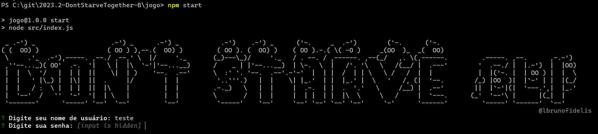
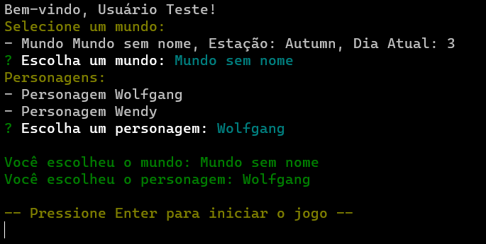
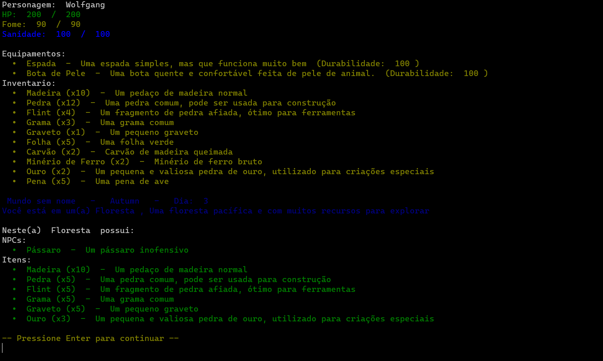
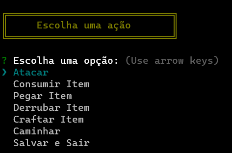
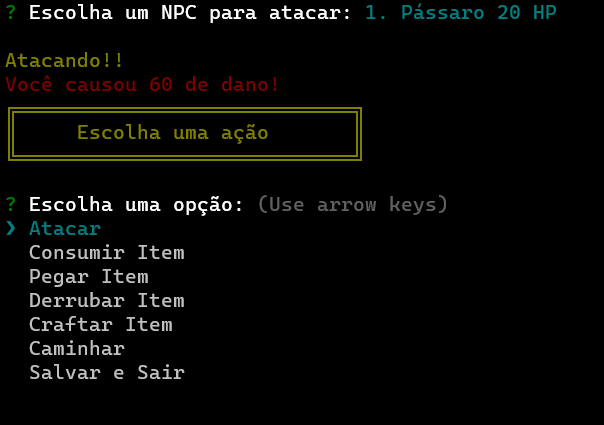

# 2023.2-DontStarveTogether-B

## Sobre
Este repositório contém informações relacionadas ao projeto de criação desenvolvimento dos artefatos e criação do banco de dados para o jogo "Don't Starve Together", para a disciplina de Banco de Dados 1.

## Don't Starve Together
"Don't Starve Together" é um jogo de sobrevivência cooperativo desenvolvido pela Klei Entertainment. O jogo se passa em um mundo misterioso e (muito) desafiador, onde os jogadores devem colaborar para sobreviver em um ambiente hostil, coletando recursos, construindo estruturas e enfrentando perigos.

  

## Módulos da Disciplina:
### Módulo 1
 - [DER/MER](./docs/DER_MER_dont_starve_together.md)
 - [Modelo Relacional](./docs/MRel_dont_starve_together.md)
 - [Dicionário de Dados](./docs/DD_dont_starve_together.md)

### Módulo 2
 - [DDL](https://github.com/SBD1/2023.2-DontStarveTogether-B/blob/main/sql/DDL.sql)
 - [DML](https://github.com/SBD1/2023.2-DontStarveTogether-B/blob/main/sql/DML.sql)
 - [DQL](https://github.com/SBD1/2023.2-DontStarveTogether-B/blob/main/sql/DQL.sql)
 - [Algoritmo Relacional](./docs/Algebra_Relacional_dont_starve_together.md)
 - [Formas Normais](./docs/Dependencias_funcionais_normalizacao.md)
 - [Apresentação](https://www.youtube.com/watch?v=KvMzjG1tIjk)

### Módulo 3
- [Triggers/Stored Procedures](https://github.com/SBD1/2023.2-DontStarveTogether-B/blob/main/sql/triggers-sp)
- [Permissões](https://github.com/SBD1/2023.2-DontStarveTogether-B/blob/main/sql/usuarios.sql)
- [Jogo](https://github.com/SBD1/2023.2-DontStarveTogether-B/tree/main/jogo)
- [Apresentação](https://www.youtube.com/watch?v=BGKRGwI11oI&ab_channel=LuisBrunoFidelis)

### Entrega final 
- [Apresentação](https://youtu.be/8nX1psgBULk)

### Configurando o banco de dados
- Para criar e popular o banco, execute todas as transações presentes no [DDL](https://github.com/SBD1/2023.2-DontStarveTogether-B/blob/main/sql/DDL.sql) e no [DML](https://github.com/SBD1/2023.2-DontStarveTogether-B/blob/main/sql/DML.sql) (exceto os drop database). 
- Execute a criação do usuário `node` no [SQL de Usuario](https://github.com/SBD1/2023.2-DontStarveTogether-B/blob/main/sql/usuarios.sql) para que a aplicação se conecte ao banco por meio dele.
- Execute as Stored Procedures/Triggers presente no diretório [`triggers-sp`](https://github.com/SBD1/2023.2-DontStarveTogether-B/tree/main/sql/triggers-sp) para garantir a integridade do banco de dados

### Rodando o jogo
- Instale os pré-requisitos: Nodejs e Npm (ou outro gerenciador de pacotes de preferência);
- Entre na pasta `jogo/`
- Execute `npm install` para instalar as dependências
- Para iniciar o jogo execute `npm start`

### Telas (v1)
     
Login

     
Iniciando jogo

     
Informações

     
Menu geral

     
Atacando

### Aluno ✌🏼
- [Luis Bruno](https://github.com/lbrunofidelis)

# Histórico de Versão

| Versão |    Data    | Descrição                          | Autor                                                                                                                                  |
| :----: | :--------: | ---------------------------------- | -------------------------------------------------------------------------------------------------------------------------------------- |
|  1.0   | 02/10/2023 | Criação do Documento               | [Levi Queiroz](https://github.com/LeviQ27) [Luis Bruno](https://github.com/lbrunofidelis) [Andre Goretti](https://github.com/AGoretti) |
|  1.1   | 23/10/2023 | Cria tópicos e links p/ documentos | [Luis Bruno](https://github.com/lbrunofidelis)                                                                                         |
|  1.2   | 29/10/2023 | Atualiza links p/ documentos       | [Yago Amin](https://github.com/Yagoas)                                                                                                 |
|  1.3   | 21/11/2023 | Atualiza links p/ Triggers/SP e Normalização      | [Luis Bruno](https://github.com/lbrunofidelis)                                                                                         |
|  1.4   | 24/11/2023 | Atualiza links p/ módulo 3 | [Luis Bruno](https://github.com/lbrunofidelis)                                                                                         |
|  1.5   | 10/12/2023 | Atualiza instruções | [Luis Bruno](https://github.com/lbrunofidelis)                                                                                         |

### ➡➡ [Endereço do antigo repositório](https://github.com/SBD1/2023.2-DontStarveTogether/graphs/contributors) ⬅⬅
