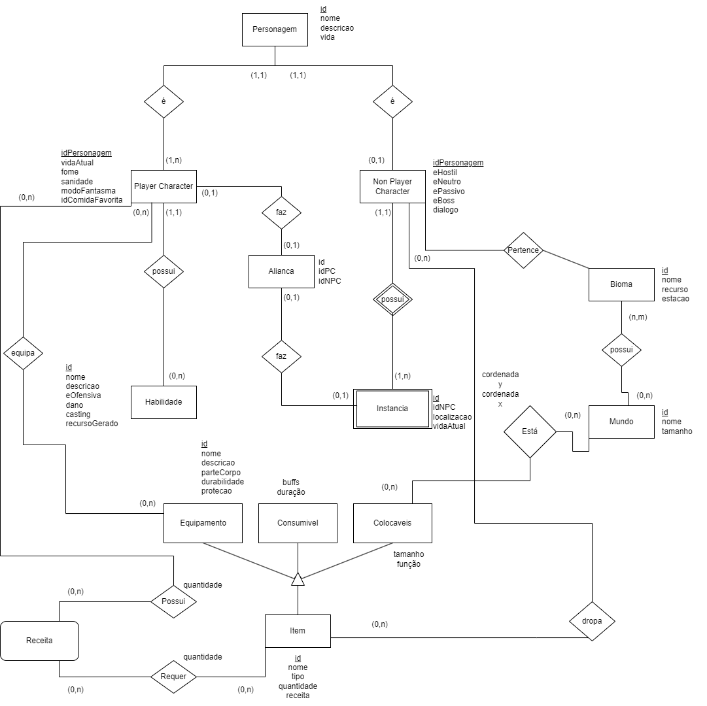
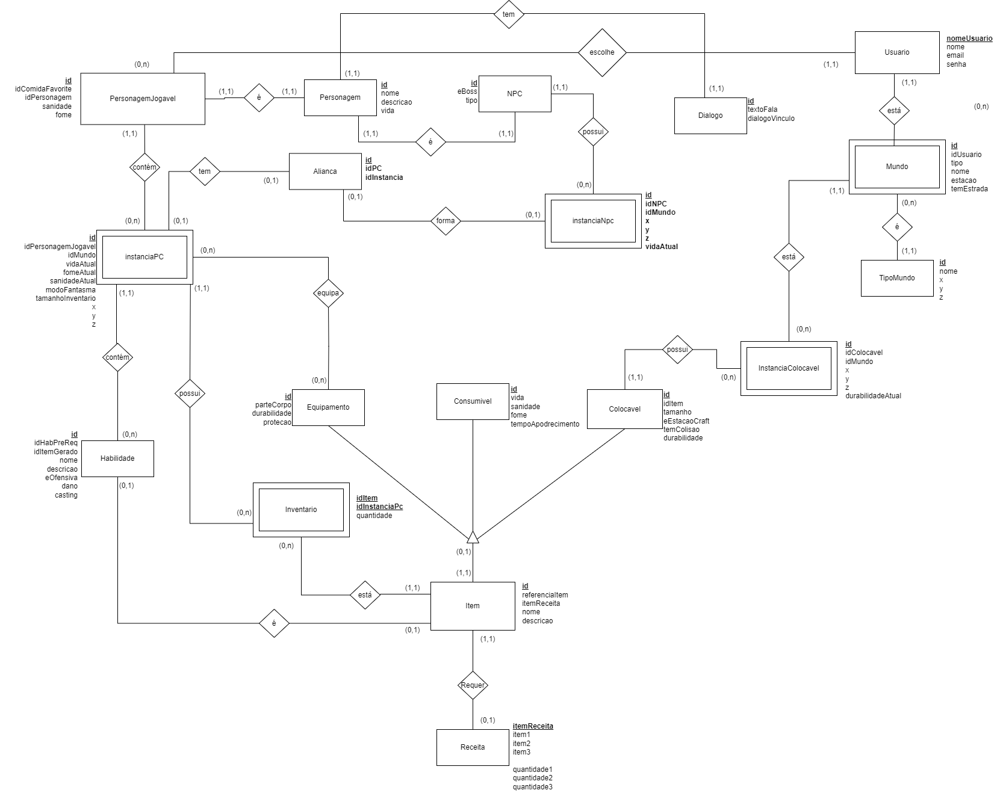
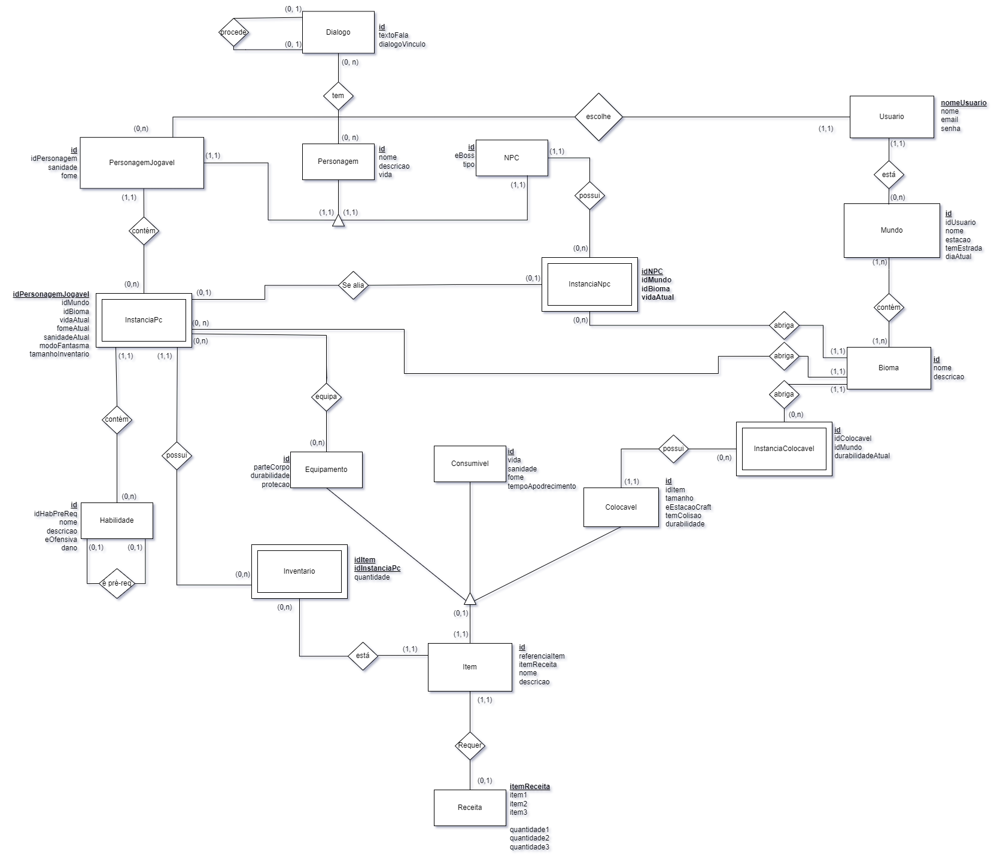

# Modelo Entidade Relacionamento (MER)

O modelo Entidade Relacionamento é um modelo conceitual que repersenta de forma abstrata a estrutura que o banco de dados da aplicação terá, contendo entidades, atributos e relacionamentos.

## Versão 1

  

## Versão 2

  

A versão 2 contempla a atualização de todas as entidades já trabalhadas, ajustes e melhorias de entidades fracas e agregações.

## Versão 3

  

A versão 3 contempla a atualização da notação da generalização de Personagem, as alterações de localização por Sala (Bioma) ao invés de coordenadas, e diversos ajustes sugeridos pela revisão do Prof. Maurício.

## 1 - Entidades

As entidades presentes no diagrama são:

 - *Usuário*
 - *Mundo*
 - *Bioma*
 - *Personagem*
 - *Dialogo*
 - *Personagem Jogável*
 - *InstanciaPC*
 - *NPC*
 - *InstanciaNpc*
 - *Habilidade*
 - *Item*
 - *Equipamento*
 - *Inventario*
 - *Consumível*
 - *Colocavel*
 - *InstanciaColocavel*

## 2 - Atributos

## 3 - Relacionamentos

## Diagrama Entidade Relacionamento (DER)

## Histórico de Versão

| Versão | Data | Descrição | Autor |
| :-----: | :------: | ------- | -------- |
| 1.0 | 02/10/2023 | Criação do Documento | [Levi Queiroz](https://github.com/LeviQ27) [Luis Bruno](https://github.com/lbrunofidelis) [Andre Goretti](https://github.com/AGoretti) |
| 2.0 | 12/11/2023 | Atualização do DER | [Luis Bruno](https://github.com/lbrunofidelis) |
| 3.0 | 28/11/2023 | Atualização do DER | [Luis Bruno](https://github.com/lbrunofidelis) |