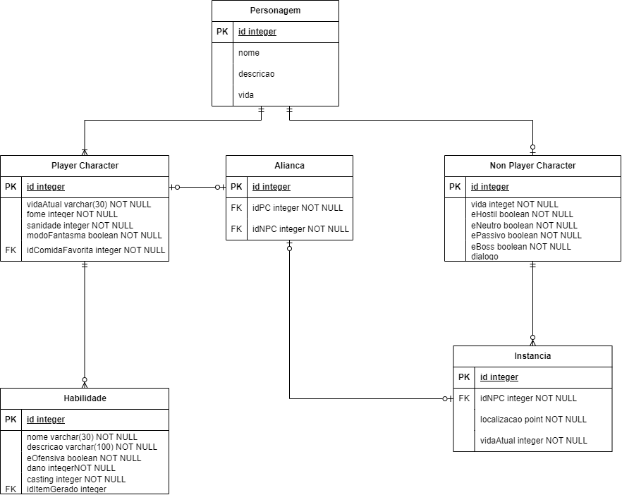
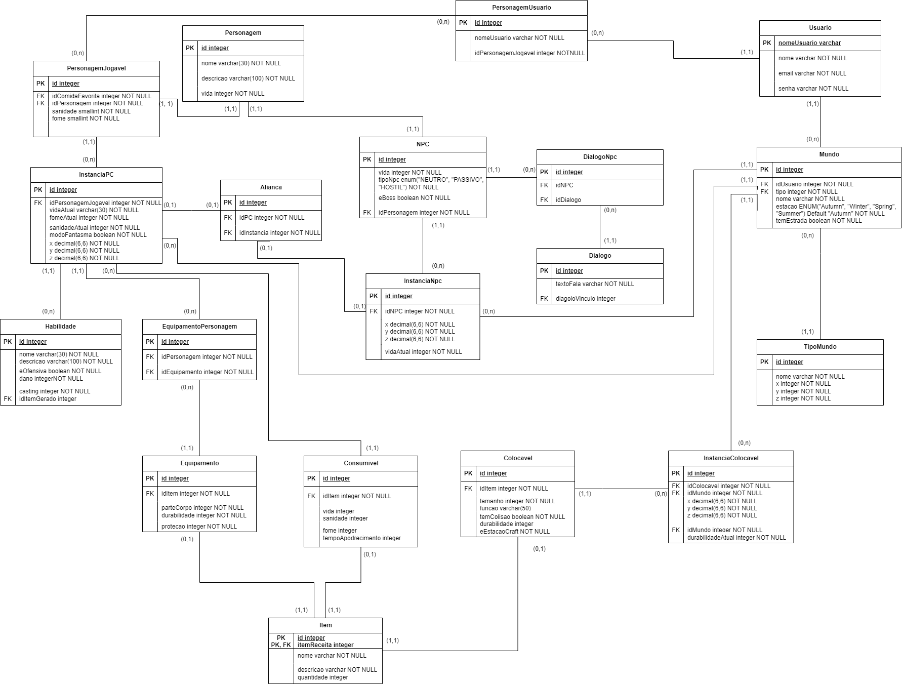
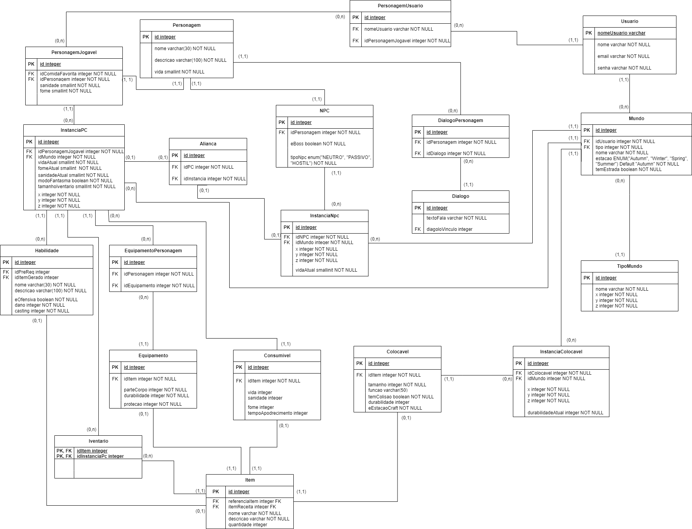
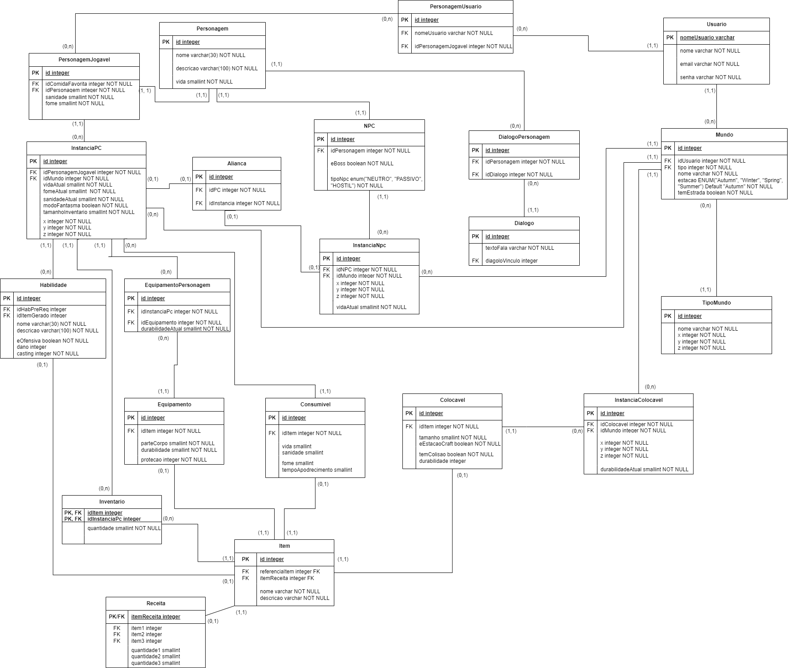
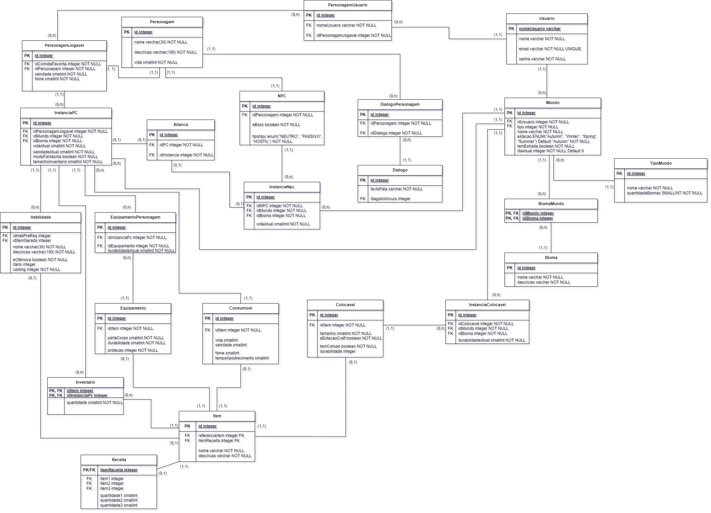
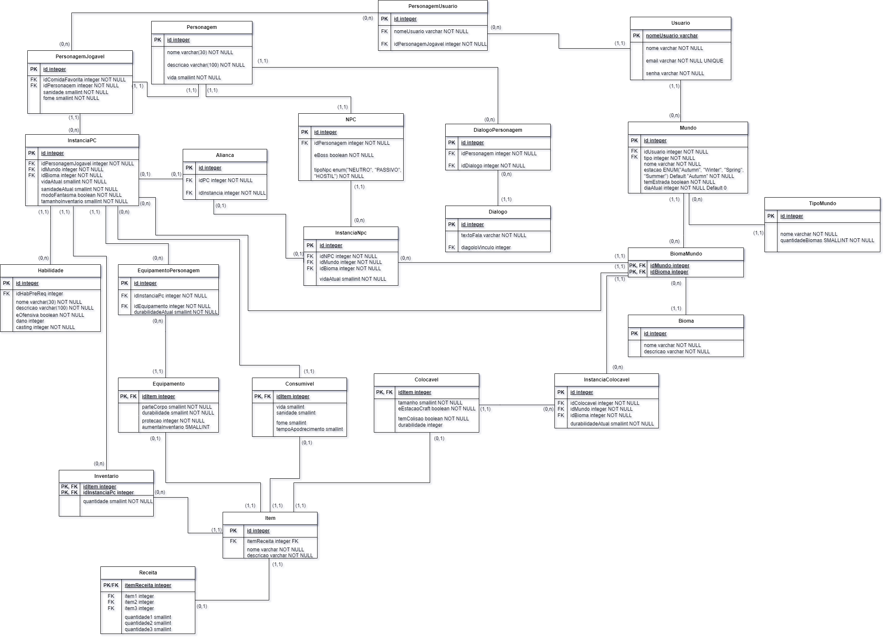
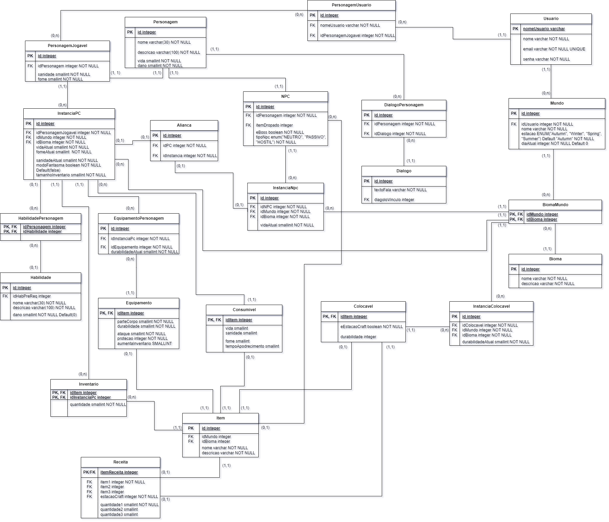

# Modelo Relacional (MRel)

### Versão 1

  

### Versão 2

  

  A versão 2 contempla a abstração de diversas entidades nas seguintes tabelas: DialogoNpc, Dialogo, Usuario, PersonagemJogavel, Mundo, TipoMundo, EquipamentoPersonagem, Equipamento, Item, Consumivel, Colocavel, InstanciaColocavel, além de contemplar a normalização até a 3FN.

### Versão 2.1

  

  A versão 2.1 contempla a criação da tabela de iventário, que é uma simples tabela com relacionamento n:n da Instância do PC com a tabela Item. Esta tabela possui chave composta, que são os ids de ambas tabelas. Também contempla os auto relacionamentos da tabela Item, que permite a criação de um item a partir de uma receita. Além disso, pequenas modificações nos tipos de outras tabelas, tal como o DECIMAL(6,6) das coordenadas das instâncias, que se transformaram em INTEGER.

### Versão 2.2

  

 
A versão 2.2 trouxe modificações significativas na estrutura da tabela de itens. A separação da parte de receita foi implementada visando evitar redundâncias e garantir a devida normalização. Adicionalmente, a atualização possibilitou a separação dos itens conforme suas quantidades corretas para o processo de criação. É importante ressaltar que a tabela de receitas foi transformada em uma entidade fraca de itens, resultando em melhorias substanciais no sistema como um todo.

### Versão 3.0

  

 
A versão 3 traz as modificações do banco voltadas para o sistema de Salas, ao invés de coordenadas, como sugerido para melhor dinâmica no desenvolvimento do jogo. Essa versão contempla a adição das tabelas Bioma e BiomaMundo que representam, respectivamente, uma "sala" e o relacionamento n-n entre Bioma e Mundo. Além disso, foi atualizado que toda tabela Instância (InstanciaPC, InstanciaNPC, InstanciaColocavel) perderam as colunas x, y e z (antigo sistema de coordenadas) e ganharam a coluna idBioma. Dessa forma, cada Instância possui as colunas idBioma e idMundo, sendo chave primária composta para BiomaMundo, sendo possível localizar cada instância.

### Versão 3.1

  

 
A versão 3.1 aborda a normalização das tabelas de itens e de personagens, com a remoção do id único das tabelas e adicionando o id da tabela "pai" da espcialização como PK/FK. Além disso, faz correção nas ligações entre tabelas de instância para BiomaMundo.

### Versão 4

  

 
A versão 3.1 aborda a criação da tabela HabilidadePersonagem, a criação do relacionamento Colocavel com Receita, a atualização de colunas, tipos e normas de integridade.

# Histórico de Versão

| Versão | Data | Descrição | Autor |
| :-----: | :------: | ------- | -------- |
| 1.0 | 02/10/2023 | Criação do Documento (apenas criou template) | [Levi Queiroz](https://github.com/LeviQ27) |
| 1.1 | 02/10/2023 | Adiciona Mrel | [Luis Bruno](https://github.com/lbrunofidelis) |
| 2.0 | 23/10/2023 | Cria versão 2 | [Luis Bruno](https://github.com/lbrunofidelis) |
| 2.1 | 28/10/2023 | Cria versão 2.1 | [Luis Bruno](https://github.com/lbrunofidelis) |
| 2.2 | 30/10/2023 | Cria versão 2.2 | [Luis Bruno](https://github.com/lbrunofidelis) |
| 3.0 | 16/11/2023 | Cria versão 3 | [Luis Bruno](https://github.com/lbrunofidelis) |
| 3.1 | 17/11/2023 | Atualiza versão 3 (normalização dos itens e instâncias) | [Luis Bruno](https://github.com/lbrunofidelis) |
| 4.0 | 02/12/2023 | Atualiza versão 4 | [Luis Bruno](https://github.com/lbrunofidelis) |
